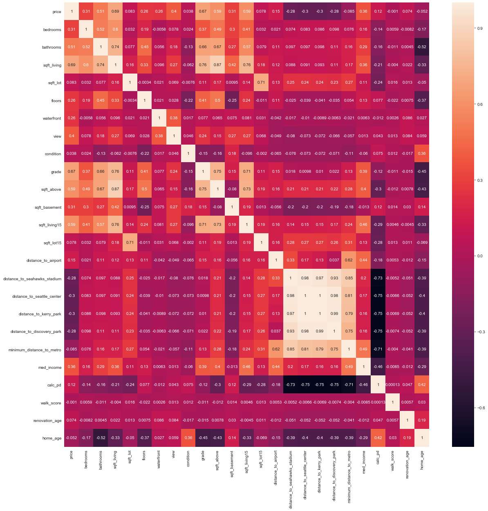

# King County's Housing Market

With the ongoing pandemic of COVID-19, interest rates for mortgages have dropped which opens up many financial opportunities for people to buy homes.  According to [Forbes](https://www.forbes.com/sites/forbesrealestatecouncil/2020/09/21/a-newfound-reality-buyers-currently-outnumber-sellers-in-housing-market/#7065905d339d), "buyers are currently outnumbering sellers [and] with so much demand and a low inventory, [seller]s are bound to make a quick sale and a higher profit."  Now is the time to act quickly to make profits in real estate, and if you're looking into the housing market in King County, WA, save time and maximize profits by searching armed with the information provided below.

## The Data

There are many factors that can affect a home's overall saleprice: from the individual characteristics of the property to the surrounding community in which the property is located.  But there is no single factor that can predict the sales price of a home; rather, it is the combination of the factors.  Some factors also hold the same weight as other factors.  The data represented in the heatmap below represents all the data gathered for King County's housing data from 2014-2015.

## What affects the sale price?

Out of the many factors that play into pricing a home in King County, the natural tiers and distinct patterns of price brackets that are created by the location of the houses seems to be the largest contributing factor to the price of a house.  The following factors will be explored through the analysis of the following characteristics in relation to the location of the house:  

* Price per Square-Foot
* Distances to Points of Interest
* Population Density

### Square Footage and House Price

Properties with larger square footages tend to hold a higher value.  However, when considering other factors (especially location) square footage alone can't illustrate a concrete trend in housing prices.  In order to visualize the trends, square footage of homes will be observed on the basis of longitude and latitude juxtaposed with its prices to obtain a better understanding of the relationship of square footage and house price.

#### Square Foot Map

> The plot above displays a trend where the concentrations of houses with lower square footage towards the west of King County. 
    
#### Price Per Square Foot Map

> Note how the price per squarefoot has a general trend of being the higher in the northern half of King County.

### How does proximity to different points of interest  in King County affect housing prices? 

In order to see how proximity to a point of interest affects housing prices, the average housing price within a certain interval will be observed: using 5 mile intervals starting at 0 miles and ending at 30 miles. By looking at the average housing price in each interval, trends will be better displayed.

#### Organization/Code Cleanliness

> asdf

#### Organization/Code Cleanliness

> The

#### Organization/Code Cleanliness

> asdf

### Population Density

asdf

#### Overall points of Interest

>asdf

#### Organization/Code Cleanliness

> asdf

## More Data

sdf

## Modelling the Data

 
 
## Conclusion

Location Matters!